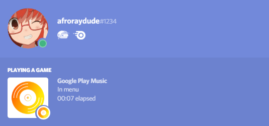
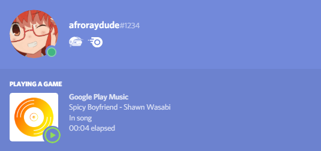

# Alaun
A simple Google Play Music standalone app with Discord integration

When not playing:



When playing a song:




## Installation

### Via Git
```bash
git clone https://github.com/afroraydude/alaun

cd alaun

npm install

npm start
```

## Building to executable
Windows:
```powershell
$env:ELECTRON_BUILDER_ALLOW_UNRESOLVED_DEPENDENCIES = 'true'

electron-builder --win
```

Linux:
```bash
#!/bin/bash
export ELECTRON_BUILDER_ALLOW_UNRESOLVED_DEPENDENCIES=true

electron-builder -l
```

## Credits
Play button icon made by Appzgear